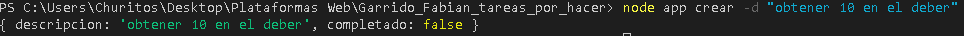
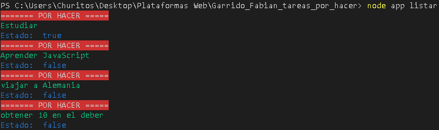
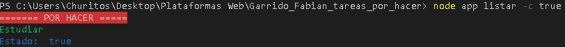
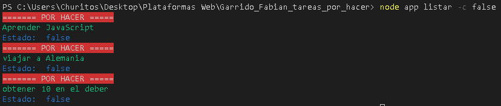
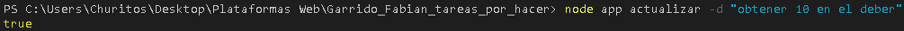
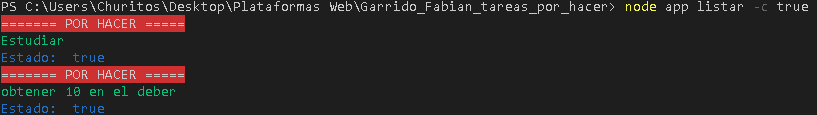
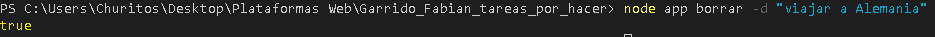
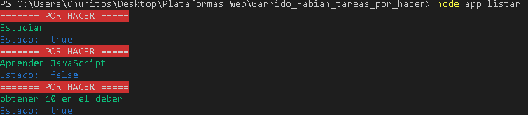

## TAREAS POR HACER (AGENDA EN CONSOLA)

Está aplicación puede agregar nuevas tareas, actualizar su estado, borrar tareas 
y finalmente listar las tareas que desee sea tareas completas o incompletas.

Para que funcione está aplicación utlizamos persistencia a una base de datos
en este caso se utliza un archivo JSON.


Instalar los paquetes con:

```
npm install
```


Instrucción para agregar una nueva tarea
```
node app crear -d "Ingresar nueva tarea" 
```



Instrucción para listar todas las tareas que tenemos en nuestra base de datos

```
node app listar
```




Instrucción para listar tareas completadas

```
node app listar -c true
```



Instrucción para listar tareas incompletas

```
node app listar -c false
```



Instrucción para actualizar el estado de una tarea

```
node app actualizar -d "Ingresar la tarea a actualizar" 
```






Instrucción para borrar una tarea

```
node app borrar -d "Ingresar la tarea que deseas borrar" 
```






